# Medidas de 10 Aplicativos con OZM V2  con armónicos

En este respositorio se presenta en los cuadernos adjuntos,  el análisis de las medidas de 10 aplicativos incluyendo transitorios hasta el orden 150 de tensión, corriente y potencia. Las Medidas se realizan con 3 OpenZmeter Trifásicos (cada uno con 4 canales de medida) conformando así en total 11 canales de medida que se distribuyen en los 10 aplicativos, más el agregado. Las medidas corresponden a W, VAR, VA, f, VLN, PF y A, más los armónicos hasta el orden 50 de W, V y A, todas con una marca de tiempo (Timestamp) de 13 dígitos tipo UNIX Epox.
La generación del Dataset se hizo con el nuevo convertidor/conversor diseñado para esta ocasión, partiendo de 11 ficheros csv de medidas que resultaron de unir cada fichero csv de cada aplicativo de cada día con el csv de ese mismo aplicativo y ese mismo día.

**\*\*DEBIDO A SU GRAN TAMAÑO , POR SU EXTENSION, NO ESTAN DISPONIBLES LOS FICHEROS DE DATOS EN FORMATO CSV EN ESTE REPOSITORIO, PERO SI ESTA DISPONIBLE EN ESTE REPOSITORIO DSUALM10H EL DATASET COMPLETO  DE FOPRMA COMPRIMIDA EN FORMATO RAR CON TODOS LOS ARMONICOS CON EL TIEMPO HABITUAL DE MUESTRAS. \*\***

Estos datos se entrenaron, tanto con el algoritmo combinatorio (CO), como el algoritmo de Markov Oculto (FHMM), pero el algoritmo que mejores resultados devolvió es CO, dado que con FHMM ha sido imposible ejecutarlo con tiempos de sampling inferiores a 90segundos por falta de memoria física (incluso devolvió errores usando maquinas con más de 64GB de RAM).

Nuestro objetivo es proporcionar a los investigadores de NILM nuevos repositorios de datos para ampliar el abanico existente. Dado que estos nuevos conjuntos de datos pueden contener más de 150 variables eléctricas registradas a alta frecuencia en diferentes aplicaciones de uso cotidiano, al ofrecer esta amplia gama de datos, esperamos impulsar y mejorar las investigaciones en el campo del NILM.

A continuación, se expone de forma genérica las conclusiones principales de tomar solo los armónicos impares, despreciando todos los armónicos, tomando todos ellos (pares e impares), o ampliando el tiempo de muestra

**ARQUITECTURA**

Para el proceso de desagregación con los medidores inteligentes OZM usaremos el Toolkit NILMTK, cuyo flujo podemos ver en la ilustración siguiente.

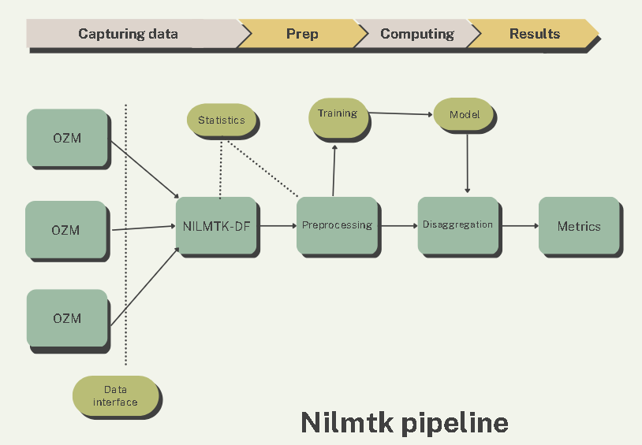

Figure 2-NILMTK flow diagram

1.  **Generación de los nuevos DS**

Los modelos presentados en este estudio emplean los registros de múltiples horas de funcionamiento de diversos dispositivos utilizando la API OZM, para lo cual usamos tres dispositivos OZM trifásicos con objeto de obtener 12 canales de medida reservando uno de estos para el agregado.

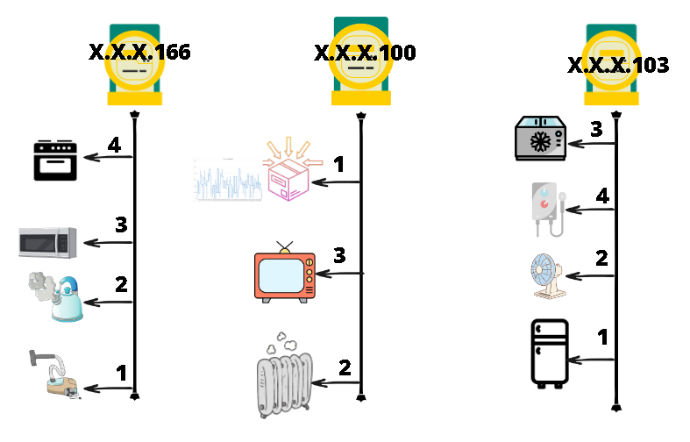

Figure 3 - Schematic diagram of OZM's connections with the applications.

Los aplicativos usados en el experimento son los siguientes:

1 -Main

2 - Electric Furnace (Horno)

3- Microwave (Micro Onda)

4 - Television

5 - Bulb (bombilla)

6 - Vacuum Cleaner (Aspiradora)

7- Electric Space Heater (Radiator de aceite)

8 - Electric Shower Heater (Calentador de agua)

9 - Fan (Ventilador)

10 - Fridge (refrigerador)

11 - Freezer (congelador)

Los datos recolectados por los OZM’s se almacenan en archivos con 160 campos de datos. Sin embargo, no todos estos campos son relevantes en todas las fases de este estudio, por lo tanto, es necesario adaptarlos para su uso en NILMTK [1].

Como primer paso, se realizará un análisis preliminar de los archivos de datos o preprocesado de los datos, donde se descomprimirán todos los ficheros de medidas desde el formato *parquet* al formato csv, añadiendo una cabecera con los nombres de las medidas y sustituyendo los valores angulares de los armónicos por el módulo. Asimismo se realiza un análisis de fechas y horas, dado que puede haber desfases en los tres campos de fechas devueltos por ozm ( *FistTimestamp, OriginaTimestamp* y *Time*). Finalmente, para cada fichero csv se reorganizan las cabeceras y eliminan caracteres no deseados.

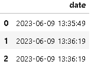

Table 1- Different dates generated by oZM

La siguiente tarea de carga y análisis de los datos, consiste principalmente en convertir los diferentes archivos de medidas preprocesados en la fase anterior junto a los metadatos, en un único archivo en formato HDF5, archivo que se almacenará en la carpeta de ejecución [2].

Normalmente, NILMTK utiliza formatos estandarizados de DS, pero debido a la exclusividad de los datos proporcionados por OZM, se necesita un nuevo conversor para los datos. Para esto, se han creado un nuevo convertidor, así como una nueva función *convert_ualm* para cargar los ficheros de medidas en formato csv de los OZM al nuevo DS en formato H5. Para ello en el directorio de NILMTK de los convertidores, no solo se incluirá el nuevo código Python del convertidor (basado en el convertidor IAWE), sino que también se creará un subdirectorio en "/metadata/" que contendrán los archivos de metadatos en formato YAML. La Figura 4 muestra la configuración de todos los archivos necesarios para el nuevo convertidor, así como la estructura de directorios requerida.

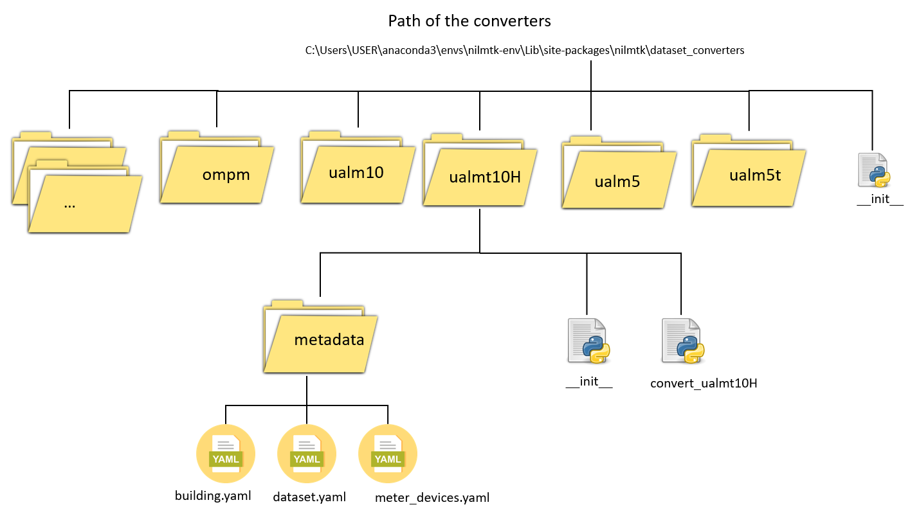

Figure 4-Metadata file structure

Como cada fichero csv es obtenido en la fase de anterior a partir de los ficheros de los OZM, es necesario numerarlos, siendo el nº 1 el correspondiente al medidor principal. Para ello, la nueva función accede a todos los citados ficheros de datos de medidas localizados en la carpeta de entrada “/electricity/”, usando para ello el fichero de etiquetas labels.csv, proceso que representamos en la Ilustración 5.

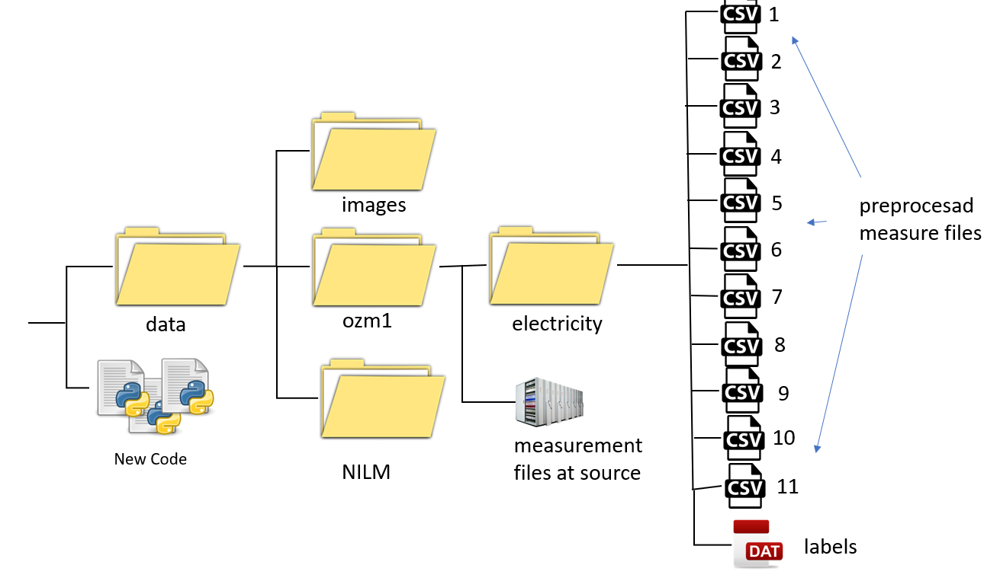

Figure 5-Data file structure

Ubicados los ficheros de datos, lo primero es invocar al conversor llamando a la nueva función **convert_ualm**, pasándole la ruta de los metadatos y el nuevo nombre del DS. Básicamente el nuevo convertidor realiza los siguientes pasos para cada fichero de medidas:

-   Lectura del fichero numerado.
-   Conversión a formato fecha del campo timestamp.
-   Carga del resto de columnas.
-   Sort-index.
-   Resample.
-   Re-indexación del fichero.

Una vez se han procesado todos los ficheros de medidas, procedemos a unir éstos en formato yaml, para posteriormente añadir los metadatos y generar finalmente un nuevo DS en formato H5.

Creado finalmente el nuevo DS, podemos realizar un preanálisis de los datos, siendo especialmente interesante representar la fracción del consumo de energía de cada aparato.

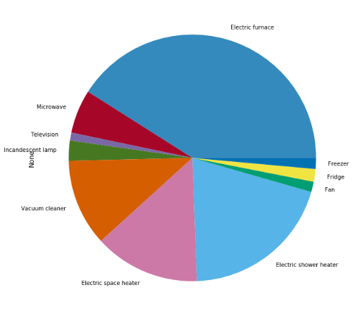

Figure 6- Representation of measurements

Es asimismo interesante observar los gráficos de tensión, potencias y corriente para todos los diferentes aplicativos, así como del agregado. No obstante, un gráfico muy aclaratorio, consiste en trazar los datos submedidos junto los datos del medidor principal.

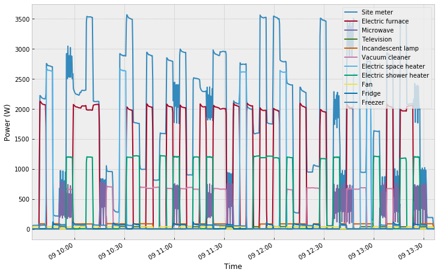

Table 2-Data of all meters

Finalmente, en este estudio se hace necesario estudiar la correlación de los datos, así como su relación con posibles cambios en el muestreo.

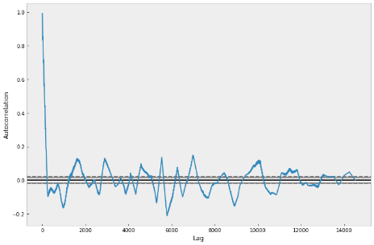

Figure 7-Graph ot autocorrelation

**Análisis, Preprocesamiento, Entrenamiento, Validación, Desagregación y Métricas**

Una vez hemos generado el nuevo DS, podemos usar las implementaciones que dispone NILMTK para realizar un diagnóstico rápido del DS. Es especialmente interesante obtener el perfil de la potencia en un gráfico de área de los aplicativos (Ilustración 7).

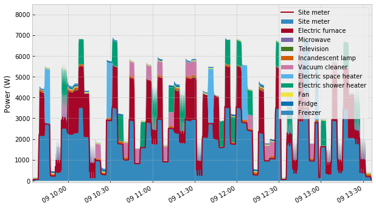

Figure 8- Voltage profile

En esta etapa también se obtiene el perfil del voltaje, se hace el cálculo posibles secciones faltantes o se descartan aquellas muestras con valores muy bajos aplicando filtros. Asimismo, es interesante obtener el registro de actividad que mostramos a continuación.

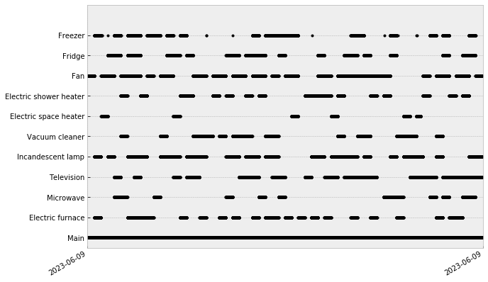

Tabla 3-Registry of activity

Finalmente analizados los datos, dividiremos el DS en **set de entrenamiento, set de validación y set de pruebas.** Para entrenar el modelo, usamos dos de los modelos de desagregación que existen disponibles en NILMTK, como son los algoritmos supervisados CO y FHMM, usando la señal de potencia activa de los dispositivos. Para ello, previamente además de cargar las librerías necesarias, definiremos el DS, y asociaremos las etiquetas asociadas a los electrodomésticos y finalmente definiremos el subconjunto de entrenamiento.

Definido el modelo de entrenamiento, gracias a que NILMTK implementa los dos algoritmos de desegregación, ejecutaremos los dos algoritmos CO y FHMM en diferentes intervalos de tiempo de muestreo usando tres métodos diferentes de relleno (First, Mean y Median), salvando los modelos generados en formato H5. Una vez computadas todas las opciones, seleccionamos el mejor modelo evaluado en la etapa de validación y ya podremos desagregar el modelo.

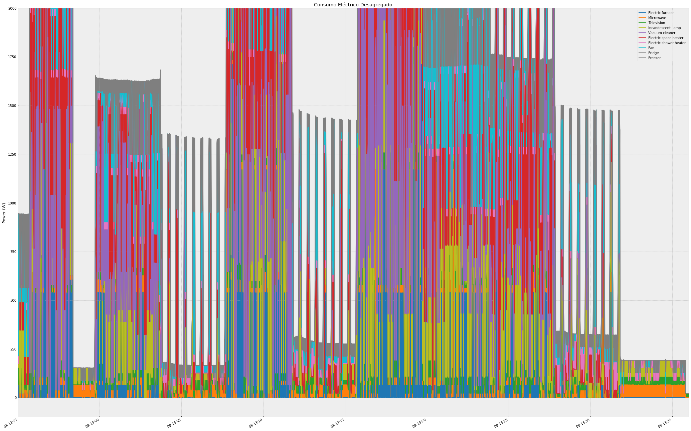

Figure 9- Disaggregate chart

Finalmente una vez desagregado las diferentes aplicativos, toca la fase de obtención de métricas para comprobar cómo ha respondido el mejor modelo, y sobre todo para decidir, si es necesario con los resultados obtenidos cambiar éste por otro más eficiente. Para facilitar esta labor, en esta última etapa precisamente NILMTK implementa numerosas herramientas gráficas y textuales para ayudarnos en la selección del modelo que nos ofrezca las mejores métricas posibles.

Un ejemplo de gráfico para ayudarnos a seleccionar el método de relleno es el siguiente que no muestra el comportamiento de las métricas F1, EAE, MNEAP y RMSE para la ejecución del algoritmo combinatorio con diferentes métodos de relleno.

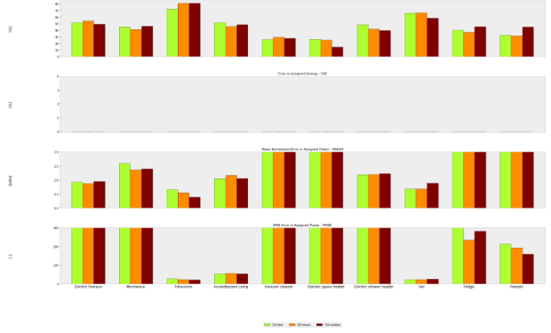

Table 4- Final results of CO

**Medidas definitivas finales con OZM tomadas el 6 de junio de 2023**

Comenzaron el día 2023-06-09 a las 09:34:38+02:00 y terminaron el día 2023-06-09 a las 13:36:19+02:00 en el Laboratorio de Electrotecnia de la Escuela de Ingeniería Industrial de la Universidad de ALmeria. También se consideran medidas unitarias del día 6 del 6. Las Medidas se realizan con 3 OpenZMeter Trifásicos (cada uno con 4 canales de medida) conformando así en total 11 canales de medida que se distribuyen en los 10 aplicativos, más el agregado.

En este repositorio se analizarán todas las medidas eléctricas por medio de 3 OpenPowerMeter (OzM) con soporte de 4 canales medidor (en total 12 canales de medidas electricas), conformando así en total 11 canales útiles de los cuales 10 son para aplicativos, uno al agregado, y una última vacante realizándose todas las medidas estas durante 4 horas a la máxima frecuencias de muestreo.

Todo el proceso se realiza en los cuadernos adjuntos a este repositorio fundamentalmente versando en el análisis de las medidas de 10 aplicativos incluyendo transitorios hasta el orden 150 de tensión, corriente y potencia.

Las medidas corresponden a W, VAR, VA,f, VLN,PF y A, más los ARMONICOS hasta el orden 150 de W, V y A, todas con una marca de tiempo (Timestamp) de 13 dígitos tipo UNIX Epox.

Para el entrenamiento se han definido tres periodos:

TRAIN(start="2023-06-09 09:34:00", end="2023-06-09 12:54:00")

VAL:(start="2023-06-09 12:55:00", end="2023-06-09 13:36:00")

TEST: (start="2023-06-06 11:19:19", end="2023-06-06 11:40:28")

Estos datos se entrenaron, tanto con el algoritmo CO, como el algoritmo FHMM.

C. Mejoras necesarias asociadas al aumento del número de aplicativos

Los resultados obtenidos para 5 aplicativos en experimentos previos[20] nos han corroborado que NILMTK con los nuevos datos de OZM responde muy bien para 5 aplicativos con tres horas de toma de muestras, obteniendo excelentes métricas (por cierto, similares tanto con CO como con FHMM) usando tiempos de muestreo óptimos entre 1 seg y 30seg y sin necesidades de cómputo específicas para procesar el Dataset (especialmente con FHMM).

Tabla 5-Results for 5 apliances

Desgraciadamente a medida que se aumenta el número de aplicativos, aumenta también la complejidad de procesar esta gran cantidad de datos con resultados aceptables. Prueba de ello, han sido las numerosas tentativas que se han realizado experimentalmente hasta llegar a la publicación del presente conjunto de datos.

Dado que la métrica F1-score mide la precisión global de la clasificación de los dispositivos eléctricos, si la comparamos para diversos aplicativos y en diferentes experimentos estos nos van a dar una idea de la precisión en la clasificación de los dispositivos en general, lo cual podemos apreciar en la gráfica siguiente.

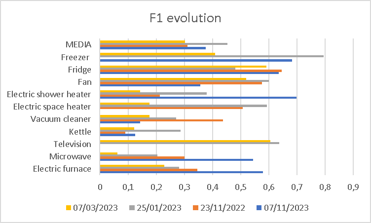

Tabla 6- Results of F1 in the experiments

Por otro lado, RMSE (Root Mean Squared Error) es una métrica utilizada habitualmente para evaluar la precisión de un modelo a la hora de predecir el consumo eléctrico de aparatos individuales o el consumo energético agregado de un hogar. Para ello el RMSE mide la diferencia cuadrática media entre los valores de consumo de energía predichos y los reales, y se expresa en las mismas unidades que los datos de consumo de energía. Un valor alto de RMSE en NILMTK indica que el modelo no predice con exactitud el consumo energético de los electrodomésticos o del hogar, lo cual significa que los valores predichos están muy alejados de los valores reales.

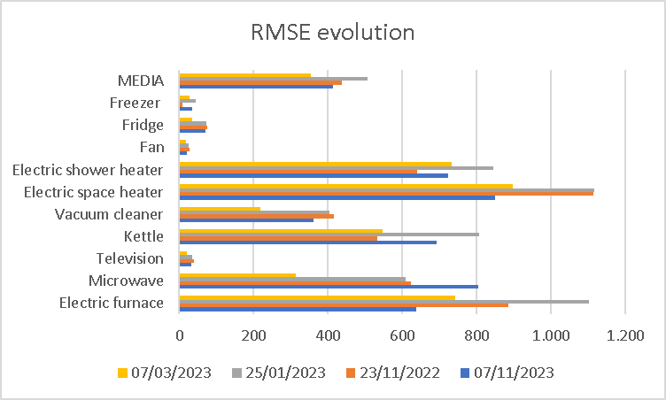

Tabla 7- Results of RMSE in the experiments

En general, un valor de RMSE bajo indica que el modelo predice mejor el consumo de energía, mientras que un valor de RMSE alto indica que el modelo tiene margen de mejora, lo cual podemos ver reflejado en el siguiente gráfico.

Como ejemplo de las fluctuaciones que pueden llegar a producirse por ruido, mal alineamiento del sensor de corriente, o fallo de este, reproducimos aquí las medidas de potencia del 25/01/2023 de la aspiradora donde se observaron 7056 medidas con potencia negativa claramente erróneas (marcadas en amarillo).

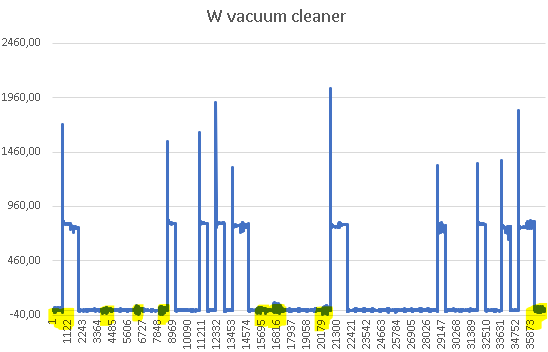

Figure 10-Evolution of power for vacuum cleaner

Esto mismo resultado, gracias a las herramientas graficas que cuenta NILMTK lo podemos apreciar diferenciado para la tensión, potencias (activa o reactiva) y la corriente:

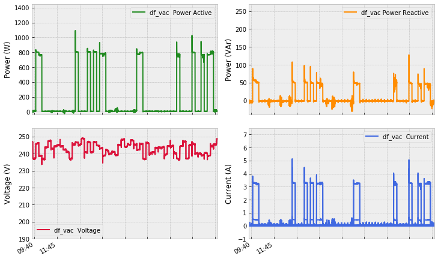

Figure 11-Power, current and voltage for vac

Si finalmente comparamos las principales métricas con las mejoras sucesivas realizadas en sucesivos experimentos, como son la ampliación del tiempo de las muestras, la reducción del ruido eléctrico, cambio de sensores y la mejora en el alineamiento de las fases activas en los sensores de núcleo dividido, vemos como hay señales de mejora significativas.

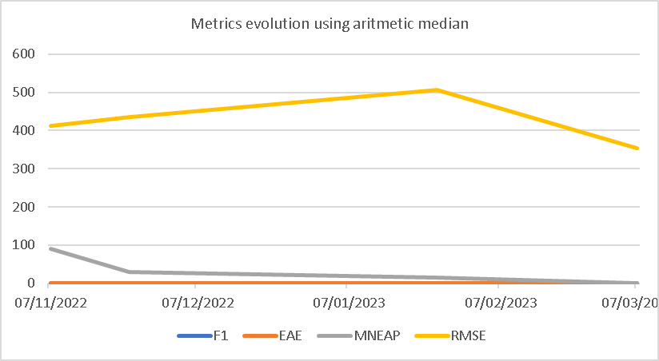

Figure 12- Improvement of metrics in the different experiments

A medida que se aumenta el número de aplicativos en el entrenamiento usando el algoritmo combinatorio no hay problemas incluso con tiempos de sampling muy pequeños, pero con FHMM puede haber dificultades importantes a la hora de ejecutar el algoritmo con el nuevo denso conjunto de datos, para lo cual se hace necesario reducir el tiempo de entrenamiento o bien reducir el tiempo de sampling (o incluso reducir el número de aplicativos), tal y como se ilustra en la siguiente tabla.

Table 8- Training possibilities with FHMM

En la tabla 8 vemos como se hace patente que para poder ejecutar FHMM con gran cantidad de muestras de alta frecuencia, se hace necesario o bien reducir el periodo de entrenamiento o bien aumentar el sampling para producir un modelo satisfactorio.

**4. RESULTADOS**

NILMTK cuenta con el cálculo de métricas de evaluación por medio del uso del MeterGroup para la validación de los resultados mediante el set de validación. Es preciso ejecutar para ello, sobre los modelos obtenidos, diferentes métricas como son FEAC, F1, EAE, MNEAP y RMSE, que para el mejor modelo (CO con sampling de 1seg) nos da una salida algo similar a la Tabla 9.

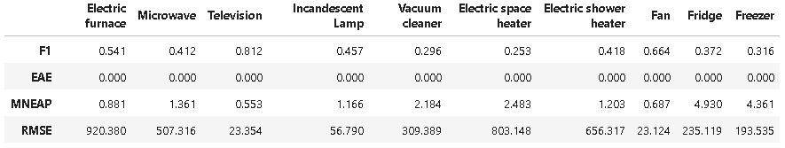

Table 9-Metrics of CO for 10 apliances

Es decir, obtenemos una puntuación para F1-Score de Media de 45.41, un valor excelente de EAE (0 de media), un valor muy bajo perfecto de MNEAP (media 1.9809) y un valor aceptable de RMSE (media 372.8472).

**Resumen de resultados sin armónicos**

En general la eliminación de armónicos para el mismo periodo entrenamiento, mismo algoritmo (CO) y un periodo de sampling de 1seg, empeora levemente casi todas las métricas para casi todos los aplicativos. En la siguiente tabla podemos ver los resultados:

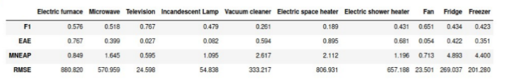

Table 13- Summary metrics without harmonics

Es decir, obtenemos una puntuación para F1-Score de Media 47,29 (algo mejor que incorporando los armónicos), un valor bastante peor de EAE (0,472 de media), un valor bajo de MNEAP (media 6,0115) pero peor que incluyendo armónicos cuya media era de 1.9809) y un valor algo peor de RMSE (media 382,2369 frente a 372.8472).

**Resumen de resultados sin armónicos impares**

En general la incorporación de solo los armónicos pares despreciando los armónicos impares para el mismo periodo de entrenamiento, mismo algoritmo (CO) y un periodo de sampling de 1seg, NO mejora las métricas para casi todos los aplicativos. En la siguiente tabla podemos ver los resultados:

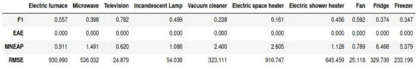

Table 11- Metrics for even harmonics only

Es decir, obtenemos una puntuación para F1-Score de Media 44,01 (peor que con armónicos o sin ellos), un valor excelente de EAE (0 de media), un valor muy bajo de MNEAP (media 2,2877) y un valor aceptable de RMSE (media 401,3312) pero bastante peor que el valor obtenido con armónicos de 372.8472.

**Comparación con otros DS**

Para el DS de IAWE los resultados nos evidencian que el algoritmo más eficiente para este DS es el combinatorio (CO) usando el método Mean y **periodo 10 minutos, frente sólo al 1 segundo necesarios con los datos del OZM**.

Table 14- Results of IAWE

Por otro lado, los resultados obtenidos para el DS de DEPS nos evidencian un mejor rendimiento para el algoritmo CO, método Mean, pero **a un tiempo de muestreo de media hora, frente sólo al 1 segundo necesario con los datos del OZM**.

Figure 15-Results of DEPS

Asimismo, si comparamos GT y Pred para el DS de DEPS, las divergencias son muy importantes, oscilando entre 1,4%, 4,6% y 4,9% frente al 0 y 1,6% que tenemos en DSUAL.

Figure 16- Comparison GT with Pred for DEPS

**V. CONCLUSIONES**

En este trabajo en el ámbito de NILMTK, además de incorporar tanto las métricas como las herramientas disponibles en el toolkit, se ha incorporado como novedad, el nuevo formato de timestamp de 13 dígitos además de nuevos conversores y convertidores para las medidas obtenidas de OZM, de modo que así se elimina la barrera de entrada a todo aquel investigador que cuente con uno o varios OZM y desee acceder al NILM. Precisamente comparando los DS obtenidos (con o sin transitorios), se ha demostrado que el uso de armónicos puede mejorar el resultado de las métricas, dependiendo, eso sí, del aplicativo a considerar.

Por otro lado, si comparamos los resultados de las métricas obtenidas sobre DSUALM o DSUALMT, frente a los DS de IAWE o DEPS los resultados son mucho peores en estos últimos, especialmente en cuanto al periodo de muestreo necesario. Destaca además el error mínimo en la desagregación en DSUALM, así como los mejores valores obtenidos para las métricas MNEAP y RMSE.

**Publicaciones**

Hay un artículo de mi autoría sobre el NILM que usa el hardware OZM monofásico en lugar del OZM v2:

-   C. Rodriguez-Navarro, A. Alcayde, V. Isanbaev, L. Castro-Santos, A. Filgueira-Vizoso, and F. G. Montoya, “DSUALMH- A new high-resolution dataset for NILM,” *Renewable Energy and Power Quality Journal*, vol. 21, no. 1, pp. 238–243, Jul. 2023, doi: 10.24084/repqj21.286.

Asimismo, con el fin de hacer replicable todo este trabajo se ha desarrollado un nuevo multi contador abierto llamado OMPM esta publicada en la revista científica “Inventions:”

-   C. Rodríguez-Navarro, F. Portillo, F. Martínez, F. Manzano-Agugliaro, and A. Alcayde, “Development and Application of an Open Power Meter Suitable for NILM,” *Inventions*, vol. 9, no. 1, p. 2, Dec. 2023, doi: 10.3390/inventions9010002.

